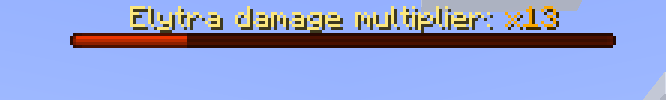

# TooManyGen

*Don't let them generate too many chunks*



## What is this?
This plugin is designed to help server owners who:
- **cannot pregenerate** their world
- have elytras enabled
- want to keep a playable view distance

## How does it work?
This plugin will count the number of chunks generated by each player. At a certain
threshold, it will start to punish the players by:
- increasing the damage to elytra
- make players risk losing their elytra
- decreasing their view distance

## How do I use it?
1. Start the server once with the plugin enabled.
2. Edit the config to your liking.
3. Restart the server.

## Configuration
```yaml
worlds:
  // specify name of the world here, you must restart server to either add or remove worlds from the config
  world:
    // number of chunks generated before the player is punished
    punishThreshold: 800
    // max distance at which we consider chunk generation
    chunkGenDistance: 32
    // the rate of cooling down the number of chunks, this is twice per second
    // so setting this to 16 means that player can generate 32 chunks per second
    coolingRate: 16
    // how much faster is the cooling rate when player stacked up a large number
    // the lower the value, the more cooling is speeded up
    coolingSpeedup: 1.25
    // the view distance values to set when the player is punished
    viewDistanceValues:
      - 8
      - 6
      - 4
    // the threshold at which we set the specified view distance
    // e.g view distance of 8 at 800 chunks, 6 at 1600 chunks, 4 at 3200 chunks
    viewDistanceThresholds:
      - 1.0
      - 2.0
      - 4.0
    // whether to enable elytra damage
    elytraDamage: true
    // the starting multiplier to the elytra damage, grows exponentially
    elytraDamageMultiplier: 3.0
    // whether to enable elytra vanish
    elytraVanish: true
    // the multiplier exceeding which the player might lose their elytra
    elytraVanishMultiplier: 60
```

## Permissions
- `toomanygen.bypass` - bypass the punishments
- `toomanygen.command` - use commands
- `toomanygen.command.reload` - use reload command

## Commands
- `/toomanygen reload` - reload the config
